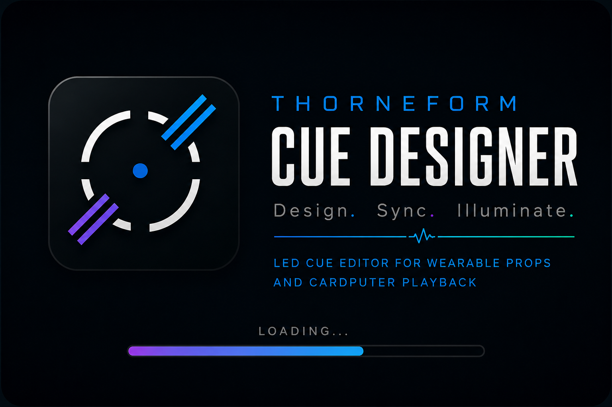
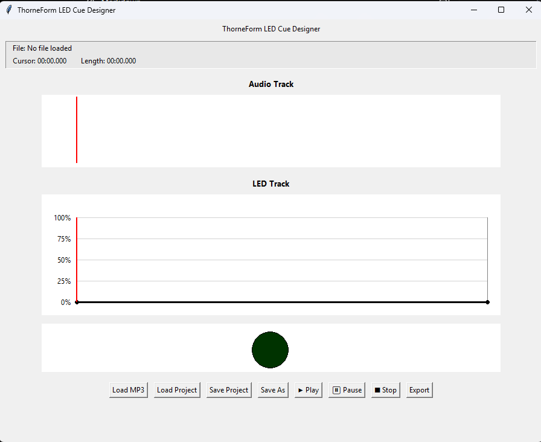

# ThorneForm Cue Designer



Desktop application for designing synchronized LED cue tracks for wearable props, costumes, and custom electronics.

ThorneForm Cue Designer was created to simplify the process of synchronizing LED lighting effects with audio for wearable props and costumes. Instead of manually editing timing values, designers can visually create, preview, save, and export lighting sequences for Cardputer-based playback.

---

## Features

- 🎵 MP3 waveform visualization
- 💡 Interactive LED timeline editor
- ▶️ Real-time synchronized playback
- 🟢 Live LED brightness preview
- 💾 Save / Load projects (.tfcue)
- 📤 Export optimized JSON for Cardputer playback

---

## Current Capabilities

- Load MP3 audio
- Display waveform
- Create LED cue points
- Smooth brightness interpolation
- Real-time playback preview
- Save and load .tfcue projects
- Export JSON for Cardputer playback

---

## Status

🚧 Version 1.0 Beta

---

## Quick Start

```bash
pip install -r requirements.txt
python thorneform_cue_designer.py
```

---

## Screenshots

### Main Editor



---

## Roadmap

- Automatic Windows builds
- Automatic macOS builds
- Multiple LED channels
- Audio markers
- Undo / Redo